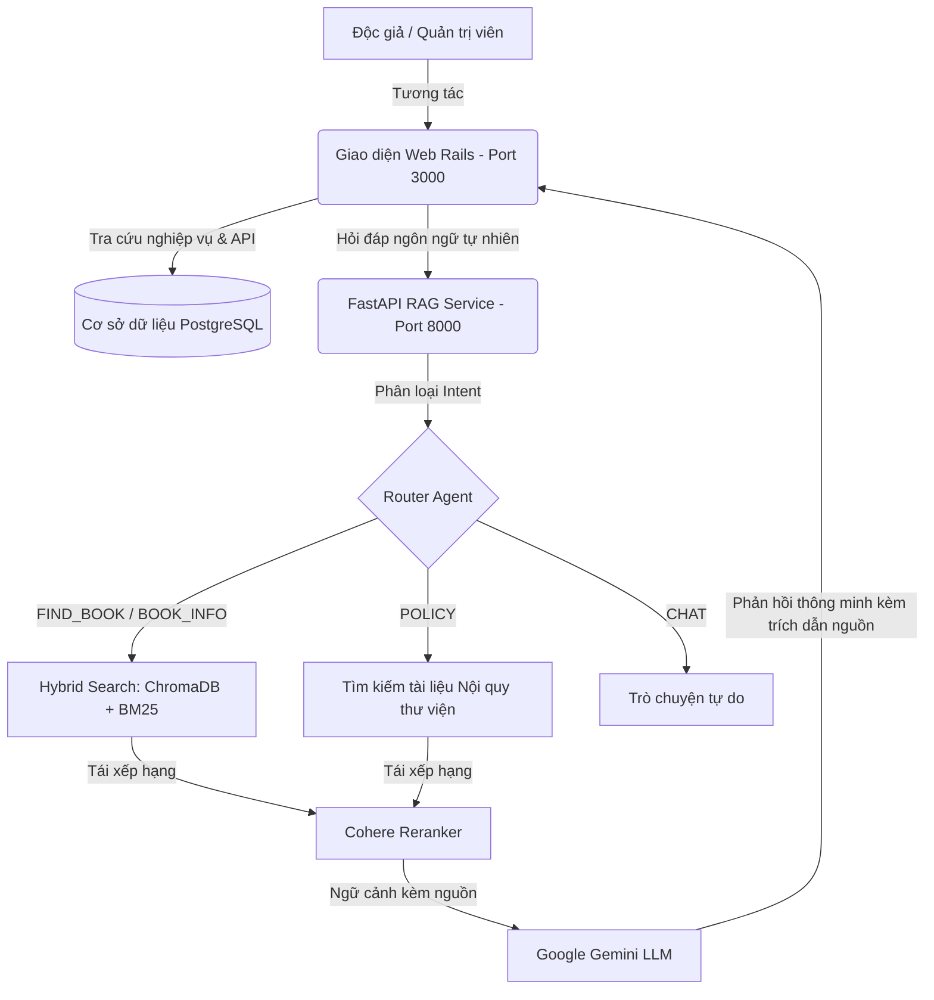

# 📚 Library Management System with RAG Chatbot Integration
> Hệ thống Quản lý Thư viện tích hợp Chatbot RAG (Retrieval-Augmented Generation) thông minh để tra cứu sách và nội quy thư viện.

Dự án này là một ứng dụng Hybrid kết hợp giữa:
- **Backend & Web App chính**: Xây dựng trên nền tảng **Ruby on Rails (v7.0.x)** kết hợp **PostgreSQL** để quản lý sách, độc giả, giao dịch mượn/trả và các tác vụ hành chính.
- **RAG Subsystem (AI API Service)**: Xây dựng bằng **FastAPI/Python**, sử dụng **LangChain, ChromaDB, HuggingFace Embeddings** và mô hình **Google Gemini (gemini-2.5-flash)** để cung cấp tính năng chat thông minh, tìm kiếm sách và hướng dẫn nội quy thư viện theo ngữ cảnh.

---

## 📝 Mô tả Đề tài (Project Description)

### 1. Đặt vấn đề & Lý do chọn đề tài
Trong các thư viện truyền thống hoặc các hệ thống quản lý thư viện số cơ bản, độc giả thường gặp phải hai rào cản lớn:
1. **Tìm kiếm tài liệu hạn chế**: Việc tìm kiếm sách chủ yếu dựa vào từ khóa chính xác (tên sách, tác giả). Độc giả khó lòng tìm kiếm sách dựa trên ngữ nghĩa hoặc mô tả nội dung chung chung (ví dụ: *"tìm sách về lòng nhân đạo thời kháng chiến"*).
2. **Khó khăn trong việc tiếp cận nội quy**: Các văn bản nội quy thư viện thường dài, nhiều điều khoản chi tiết (ví dụ: thời gian mở cửa, mức phạt quá hạn cho từng loại sách Thường/Tham khảo, quy định làm hỏng tài liệu). Việc tra cứu thủ công khiến độc giả tốn thời gian và dễ vi phạm quy chế do không nắm rõ thông tin.

**Giải pháp đề xuất**: Tích hợp kỹ thuật **RAG (Retrieval-Augmented Generation)** và **Router Agent** vào Hệ thống Quản lý Thư viện. Hệ thống không chỉ quản lý tốt nghiệp vụ sách và mượn trả truyền thống mà còn tích hợp một trợ lý AI thông minh có khả năng trả lời chính xác các thắc mắc về nội quy lẫn tìm kiếm sách dựa trên ngữ cảnh thực tế của dữ liệu nội bộ.

---

### 2. Các Phân hệ & Tính năng Chính của Hệ thống



#### A. Phân hệ Quản trị & Nghiệp vụ Thư viện (Ruby on Rails)
*   **Quản lý Tài nguyên**: Quản lý đa chiều các thực thể Thể loại, Tác giả, Nhà xuất bản và các đầu sách.
*   **Quản lý Độc giả**: Độc giả đăng ký, đăng nhập tài khoản và xác thực qua Google OAuth2.
*   **Nghiệp vụ Mượn/Trả sách linh hoạt**:
    *   Quy trình 5 bước mượn sách trực tuyến.
    *   Hỗ trợ mã QR động để định danh độc giả tại quầy mà không cần thẻ vật lý.
    *   Cơ chế tự chọn thời gian mượn linh hoạt (đơn mượn tự ấn định ngày trả dự kiến).
    *   Hệ thống tính toán thời gian quá hạn và áp dụng các mức phạt tự động (phạt theo ngày đối với sách Thường, phạt theo giờ đối với sách Tham khảo TR).
*   **API Cung cấp Metadata**: Điểm cuối (Endpoint) API cung cấp đầy đủ thông tin sách phục vụ cho quá trình nạp dữ liệu (Ingest) vào cơ sở dữ liệu Vector.

#### B. Phân hệ Trợ lý ảo AI Chatbot (Python - FastAPI & LangChain)
*   **Router Agent (Phân loại ý định)**: Sử dụng LLM phân tích câu hỏi của độc giả để phân phối vào các luồng xử lý phù hợp:
    *   `FIND_BOOK`: Tìm kiếm các cuốn sách phù hợp theo chủ đề, tác giả hoặc mô tả nội dung.
    *   `BOOK_INFO`: Trả lời thông tin cụ thể (năm xuất bản, nhà xuất bản, vị trí kệ sách cụ thể).
    *   `POLICY`: Tra cứu trực tiếp các quy định về vận hành thư viện và chính sách phạt vi phạm.
    *   `CHAT`: Trò chuyện giao tiếp tự do với người dùng.
*   **Hybrid Retrieval (Truy xuất lai kết hợp)**:
    *   *Dense Retrieval*: Sử dụng ChromaDB kết hợp mô hình embedding đa ngôn ngữ `paraphrase-multilingual-MiniLM-L12-v2` của HuggingFace để tìm kiếm theo sự tương đồng ngữ nghĩa.
    *   *Sparse Retrieval*: Sử dụng thuật toán BM25 để tìm kiếm chính xác theo từ khóa/thuật ngữ.
*   **Cohere Reranker**: Thực hiện lọc lại và sắp xếp độ ưu tiên của các đoạn tài liệu truy xuất được, loại bỏ các kết quả nhiễu để tối ưu hóa ngữ cảnh đưa vào LLM.
*   **Generation & Citations (Sinh phản hồi & Trích dẫn nguồn)**: Gọi API Google Gemini để tổng hợp phản hồi tiếng Việt tự nhiên. Hệ thống đính kèm trích dẫn nguồn gốc tài liệu rõ ràng (Tên sách, Tác giả, Trang số, hoặc mục nội quy cụ thể) giúp tăng tính xác thực và tin cậy cho câu trả lời.

---

## 🛠️ Yêu cầu Hệ thống (Prerequisites)

Trước khi cài đặt, hãy đảm bảo hệ thống của bạn đã cài đặt các công cụ sau:

- **Ruby**: `3.2.2` (Khuyên dùng `rbenv` hoặc `rvm` để quản lý phiên bản).
- **Python**: `3.10` trở lên (kèm `pip` và `venv`).
- **Cơ sở dữ liệu**: **PostgreSQL** (chạy tại cổng mặc định `5432`).
- **Hệ điều hành**: Linux (Ubuntu, v.v.), macOS, hoặc Windows (khuyên dùng WSL2).
- **API Keys**:
  - `GOOGLE_API_KEY`: API key của Google AI Studio (để gọi mô hình Gemini).
  - `COHERE_API_KEY`: API key của Cohere (sử dụng cho tính năng Re-ranking tài liệu).

---

## 📦 Hướng dẫn Cài đặt & Cấu hình Chi tiết

### Bước 1: Thiết lập Biến môi trường

1. Tại thư mục gốc của dự án, sao chép file cấu hình môi trường mẫu:
   ```bash
   cp .env.example .env  # Nếu chưa có .env
   ```
2. Mở file `.env` và điền đầy đủ các thông tin cấu hình, đặc biệt là các API Key quan trọng cho RAG:
   ```env
   GOOGLE_CLIENT_ID=your_google_oauth_client_id
   GOOGLE_CLIENT_SECRET=your_google_oauth_client_secret
   USER_MAILER_USERNAME=your_email@gmail.com
   USER_MAILER_PASSWORD=your_email_app_password
   GOOGLE_API_KEY=AIzaSy...   # Điền API Key Gemini của bạn
   COHERE_API_KEY=9SfFjR...   # Điền API Key Cohere của bạn
   ```

### Bước 2: Cài đặt và Cấu hình Cơ sở dữ liệu Rails (PostgreSQL)

1. Tạo file cấu hình database của bạn từ file mẫu:
   ```bash
   cp config/database.yml.example config/database.yml
   ```
2. Kiểm tra file `config/database.yml` và đảm bảo các thông số kết nối (username, password, host, port) khớp với PostgreSQL đang chạy trên máy của bạn.
3. Chạy các lệnh sau để cài đặt các Gem và khởi tạo database:
   ```bash
   # Cài đặt các thư viện Ruby
   bundle install

   # Tạo cơ sở dữ liệu
   bundle exec rails db:create

   # Chạy các file migrations tạo cấu trúc bảng
   bundle exec rails db:migrate

   # Nạp dữ liệu mẫu (Sách, Người dùng, Thể loại...)
   bundle exec rails db:seed
   ```

### Bước 3: Cài đặt Dịch vụ Python RAG

1. Di chuyển vào thư mục dịch vụ RAG hoặc thiết lập trực tiếp tại thư mục gốc. Dự án đã tạo sẵn cấu trúc Python trong thư mục `app/service/rag/`.
2. Tạo môi trường ảo Python (Virtual Environment):
   ```bash
   # Tạo venv tại thư mục gốc của dự án (hoặc trong app/service/rag)
   python3 -m venv venv
   ```
3. Kích hoạt môi trường ảo:
   - Trên **Linux/macOS**:
     ```bash
     source venv/bin/activate
     ```
   - Trên **Windows (PowerShell)**:
     ```powershell
     .\venv\Scripts\Activate.ps1
     ```
4. Cài đặt các thư viện Python cần thiết:
   ```bash
   pip install -r app/service/rag/requirements.txt
   ```
5. **Cấu hình đường dẫn Cơ sở dữ liệu Vector (ChromaDB)**:
   Mở file [config.py](file:///home/quynhnhu/Projects/Library-Management_RAG/app/service/rag/config.py) và cấu hình biến `VECTOR_DB_PATH` phù hợp với hệ thống của bạn:
   ```python
   # Mặc định là:
   VECTOR_DB_PATH = "/mnt/d/LibraryStorage/VectorData" # Hãy đổi thành đường dẫn thư mục mong muốn trên máy của bạn
   ```
   > [!IMPORTANT]
   > Hãy đảm bảo thư mục này có quyền đọc/ghi. Nếu bạn dùng Linux thuần hoặc macOS, hãy đổi đường dẫn sang dạng chuẩn như `/home/user/LibraryStorage/VectorData` hoặc `./db/vector_data`.

---

## 💾 Quy trình Chuẩn bị & Đồng bộ hóa Dữ liệu (PDF & Sách)

Để tính năng RAG tìm kiếm tài liệu hoạt động chính xác với cơ sở dữ liệu của Rails, bạn cần đồng bộ hóa tệp PDF sách và nạp chúng vào cơ sở dữ liệu Vector.

### 1. Cắt nhỏ và đồng bộ hóa PDF/Ảnh bìa sang ứng dụng Rails:
Đặt các file sách PDF nguyên bản vào thư mục `lib/assets/import_pdfs/`. Sau đó chạy các tác vụ Rake sau:
```bash
# 1. Trích xuất 30 trang đầu tiên của sách để làm tài liệu xem trước (Preview)
bundle exec rake pdf:cut_previews

# 2. Đồng bộ các file PDF đã cắt vào ActiveStorage của Rails
bundle exec rake books:sync_pdfs

# 3. Đồng bộ ảnh bìa sách từ thư mục `lib/assets/book_covers`
bundle exec rake books:sync_covers
```

### 2. Khởi chạy Rails Server (để cung cấp API metadata):
Chạy lệnh khởi động Rails để API của Rails sẵn sàng cung cấp metadata cho script nạp dữ liệu:
```bash
bundle exec rails server
```

### 3. Nạp dữ liệu vào Vector DB (ChromaDB):
Khi Rails Server đã chạy (ở cổng 3000), kích hoạt môi trường ảo Python và chạy các file nạp dữ liệu:
```bash
# Đảm bảo đã kích hoạt venv: source venv/bin/activate

# 1. Nạp Nội quy Thư viện vào ChromaDB
python app/service/rag/ingestor_rules.py

# 2. Nạp Nội dung sách PDF (đã cắt) kết hợp metadata từ Rails vào ChromaDB
python app/service/rag/ingestor_books.py
```

---

## 🚀 Khởi chạy Toàn bộ Ứng dụng

Để ứng dụng hoạt động đầy đủ, bạn cần chạy song song cả **Rails Server** và **Python RAG API Server**.

### 1. Khởi chạy Rails Web Server (Cổng 3000):
```bash
bundle exec rails s -b 127.0.0.1 -p 3000
```
Truy cập ứng dụng tại địa chỉ: `http://localhost:3000`

### 2. Khởi chạy Python RAG Service (Cổng 8000):
```bash
# Đảm bảo đã kích hoạt venv: source venv/bin/activate
python app/service/rag/main.py
```
*Hoặc có thể chạy bằng lệnh uvicorn:*
```bash
uvicorn app.service.rag.main:app --host 127.0.0.1 --port 8000 --reload
```
Dịch vụ API RAG sẽ chạy tại địa chỉ: `http://127.0.0.1:8000`

---

## 🔍 Kiểm tra & Debug Hệ thống RAG

Thư mục `app/service/rag/` cung cấp một số công cụ dòng lệnh hữu ích để kiểm tra trạng thái hoạt động của mô hình và cơ sở dữ liệu vector:

*   **Kiểm tra các mô hình Gemini khả dụng:**
    ```bash
    python app/service/rag/check_model.py
    ```
*   **Xem thống kê và số lượng tài liệu đã nạp trong ChromaDB:**
    ```bash
    python app/service/rag/check_db.py
    ```
*   **Chạy thử nghiệm truy vấn trực tiếp thông qua RAGEngine (để kiểm tra phân loại ý định Router & kết quả tìm kiếm):**
    ```bash
    python app/service/rag/test_debug.py
    ```

---

## 🧪 Chạy Kiểm thử tự động (RSpec)

Để chạy bộ kiểm thử tự động của Rails:
```bash
bundle exec rspec
```

---
> [!NOTE]
> Trong quá trình hoạt động, nếu bạn cập nhật thêm sách mới từ trang quản trị Rails, hãy chạy lại lệnh `python app/service/rag/ingestor_books.py` để cập nhật dữ liệu vào cơ sở dữ liệu Vector của hệ thống Chatbot.
